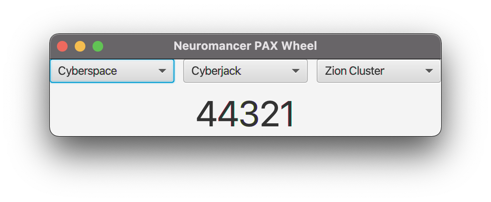

# neuromancer-pax-wheel
JavaFX implementation of the code wheel used in the classic PC game Neuromancer

## Resources Used
 [Neuromancer PAX Verification Code Wheel (Online!)]( http://www.mlsite.net/neuro/ )
 
 [Neuromancer Verification Codes Compiled By Ultra Magnus]( https://www.digitpress.com/library/manuals/c64/neuromancer_codes.txt )

## Screen Shot

